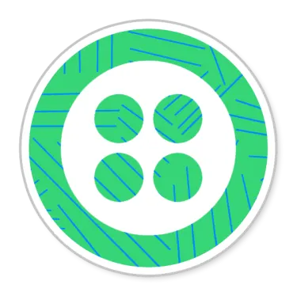
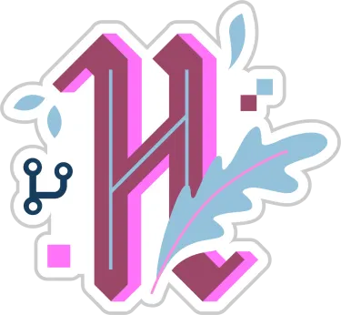

# Hi there, I'm Jack!

 
Thanks for visiting my Github Profile!  

I'm a recent graduate currently seeking job opportunities. I'm always looking to learn and collaborate.

 

## A little bit about me:

- 🔭 I’m currently working on an [Acrostic Mnemonic Generator](https://github.com/Jackmt9/Mnemonic)
- 🌱 I’m currently learning interview algorithms
- 💬 Ask me about anything!
- 🤔 I’m looking for an environment that is conducive to learning and growing
- 📫 How to reach me: LinkedIn
- 😄 Pronouns: He/Him/His
- ⚡ Fun fact: I have a background in Mathematics

 

## Stats:

 

## Badges:

🏅 Twilio Hackathon Participant Badge 🏅  

🏅 Hacktoberfest 2020 Badge 🏅  

## Other:

<!--  -->
