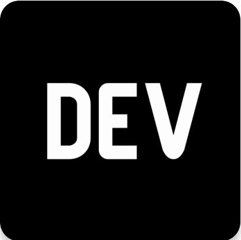

# Hi there, I'm Jack!

 
Thanks for visiting my Github Profile!  

I'm a recent graduate currently seeking job opportunities. I'm always looking to learn and collaborate.

 

## A little bit about me:

- 🔭 I’m currently working on an [Acrostic Mnemonic Generator](https://github.com/Jackmt9/Mnemonic)
- 🌱 I’m currently learning interview algorithms
- 💬 Ask me about anything!
- 🤔 I’m looking for an environment that is conducive to learning and growing
- 📫 How to reach me: LinkedIn
- 😄 Pronouns: He/Him/His
- ⚡ Fun fact: I have a background in Mathematics

 

## Stats:

 

## Badges:

🏅 Twilio Hackathon Participant Badge 🏅 (Awarded for participating in the Twilio x DEV Hackathon April 2020)

🏅 Hacktoberfest 2020 Badge 🏅 (Awarded for successful completion of the 2020 Hacktoberfest challenge.)

## Media:

<!--  -->

<!--
**Jackmt9/jackmt9** is a ✨ _special_ ✨ repository because its `README.md` (this file) appears on your GitHub profile.

Here are some ideas to get you started:

- 🔭 I’m currently working on ...
- 🌱 I’m currently learning ...
- 👯 I’m looking to collaborate on ...
- 🤔 I’m looking for help with ...
- 💬 Ask me about ...
- 📫 How to reach me: ...
- 😄 Pronouns: ...
- ⚡ Fun fact: ...
-->